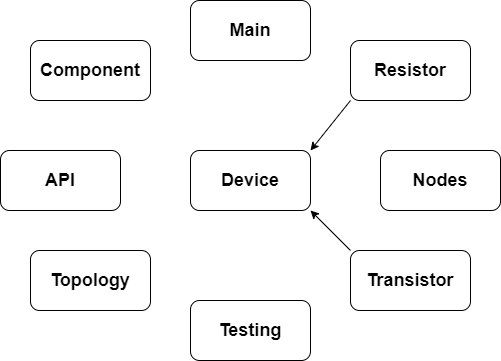
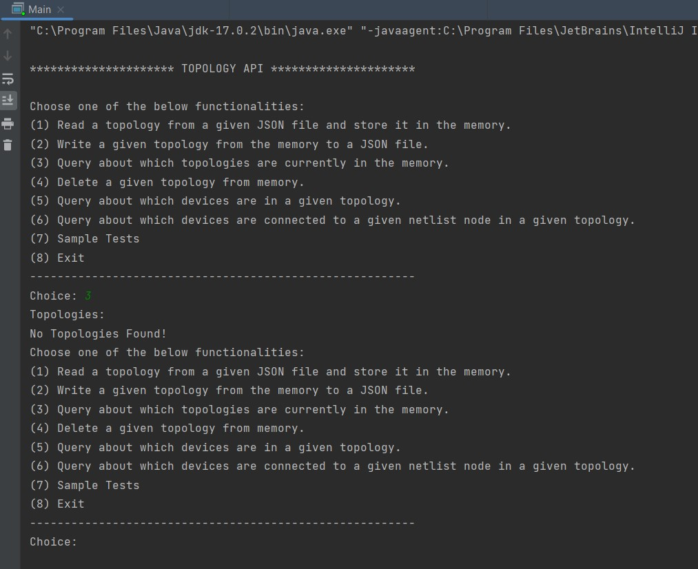
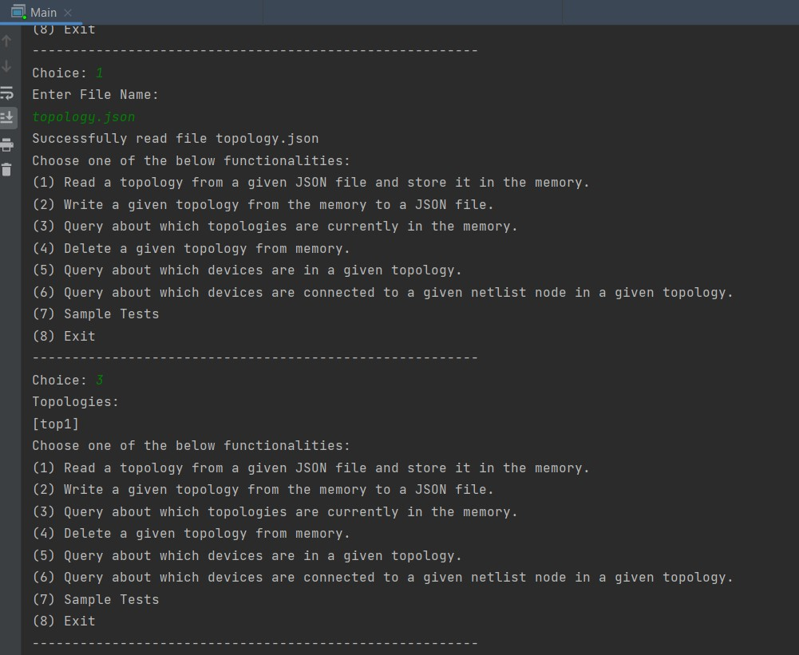
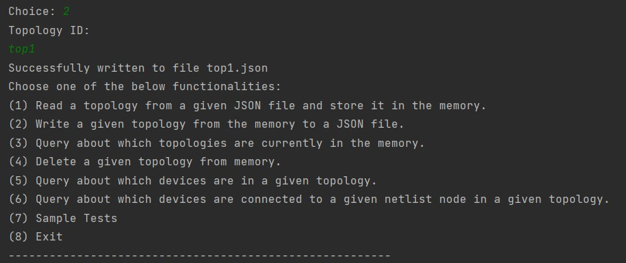
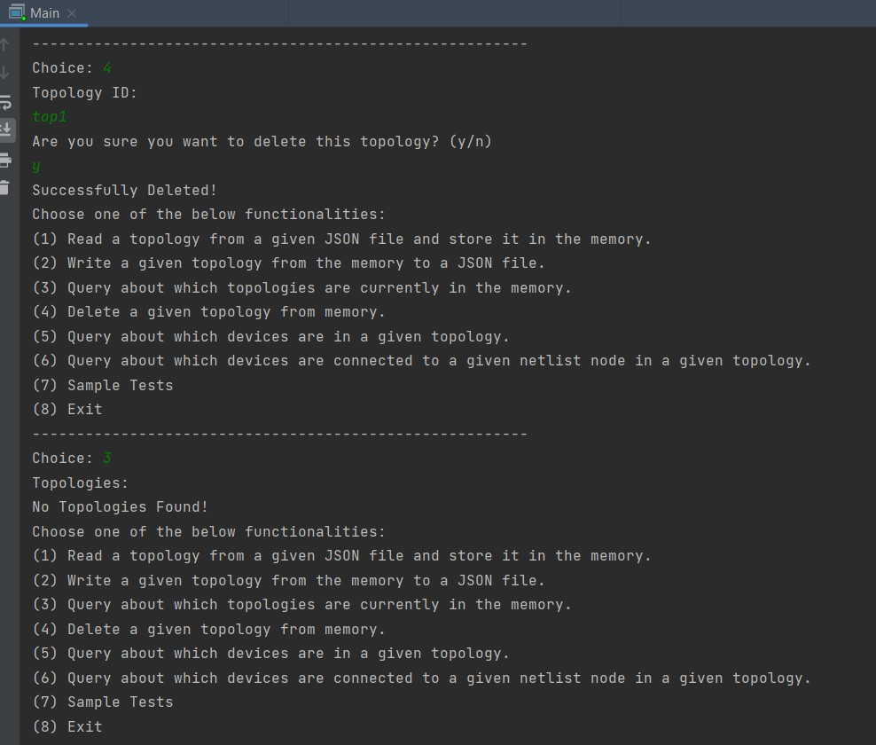
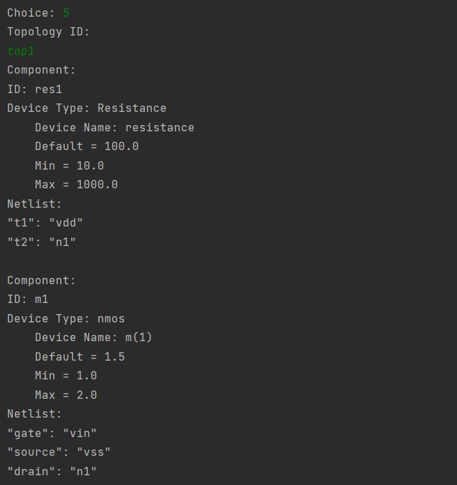
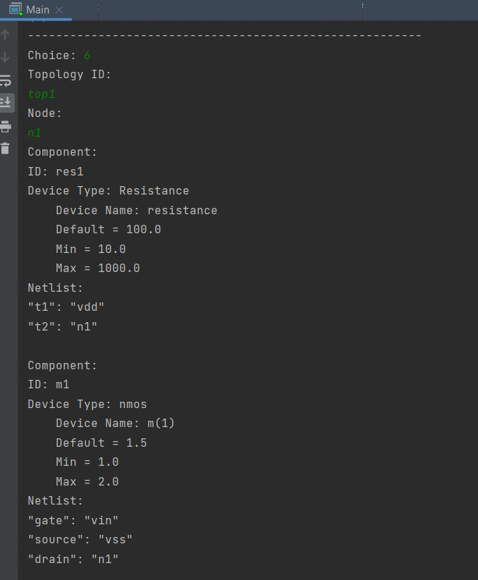
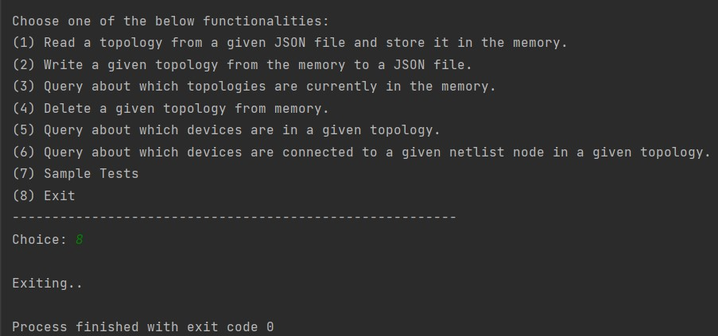
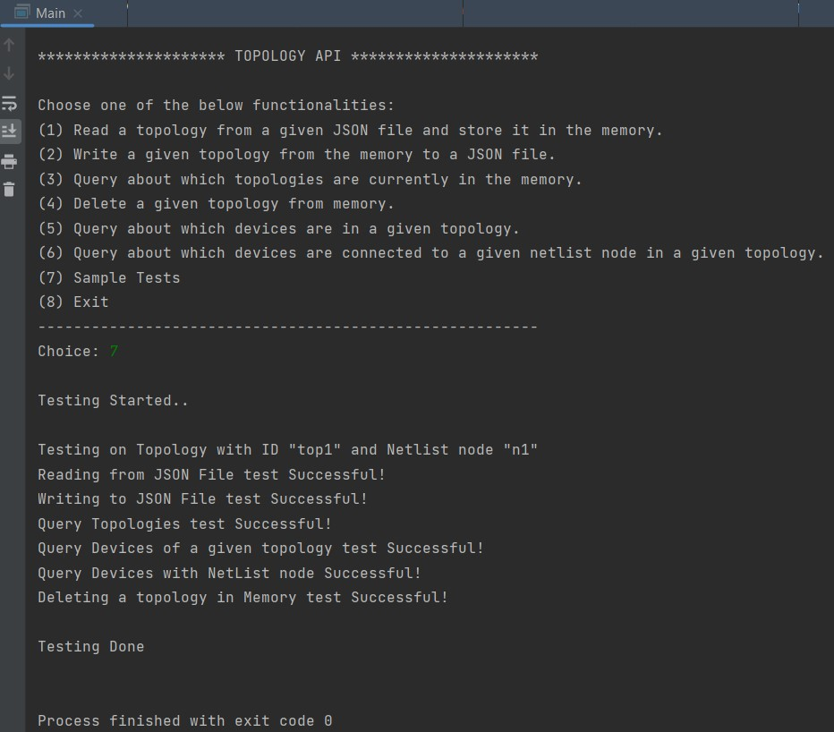

<div align="center">
 
# Topology API
 
</div>


<div align="center">

</div>

# 📙 About
An API library which provides the functionality to access, manage and store device topologies.

# 📝 Description
1. Read a topology from a given JSON file and store it in the memory.
2. Write a given topology from the memory to a JSON file.
3. Query about which topologies are currently in the memory.
4. Delete a given topology from memory.
5. Query about which devices are in a given topology.
6. Query about which devices are connected to a given netlist node in
a given topology.


# Class Structure



# 🏁 Getting Started

## Classes
### Main

* This class creates an object from the API class which is used to call each functionality
* It contains the main loop of the API which allows the user to select which operation to perform

### API

This class contains the memory of the API as a HashMap and an addToMemory function to store in it.

* This class contains the functions of the API :-
  * boolean readJSON(String fileName)
  * boolean writeJSON(String topologyID)
  * Set<String> getTopologies()
  * boolean deleteTopology(String topologyID)
  * List<Component> queryDevices(String topologyID)
  * List<Component> queryDevicesWithNetlistNode(String topologyID, String node)

* Each functionality is validated completely in case a topology/node not found for example, etc...

### Topology

* Each topology consists of components and the JSON format of the topology, 
with a unique ID and all nodes between each component in the topology
 
### Nodes

* The Topology class creates an object from class Nodes in order to set
its nodes and add to it any component in the topology

### Component

* Each component contains the ID and type of the component
as well as the device details and the NetList
 
### Device

* This class contains the device details including it's name, default value , min and max

### Resistor
 
* The resistor inherits from class device and overrides function print() to add resistance as its type
 
### Transistor
 
* The transistor inherits from class device and has an extra variable (type) to indicate whether it's
an nmos or a pmos transistor and overrides the print function as well
 
### Testing

* This class tests each function of class API

## Dependencies

* Java
* Maven Framework Support
* json.simple

## 💻 Installing

```
git clone https://github.com/abdelrahman0123/Topology-API 
```

## 📷 Screenshots

#### Query Topologies


#### Read JSON file & Query Topologies


#### Write JSON


#### Delete a topology & Query Topologies


#### Query devices in a topology


#### Query devices with netlist node

 
#### Exit


#### Testing


## Contributors

<table>
<tr>
<td align="center">
<a href="https://github.com/abdelrahman0123" target="_black">
<br /><sub><b>Abdelrahman Hamdy</b></sub></a><br />
</td>
</tr>
 </table>

## License

This project is licensed under the [MIT] License - see the [LICENSE.md](LICENSE) file for details
